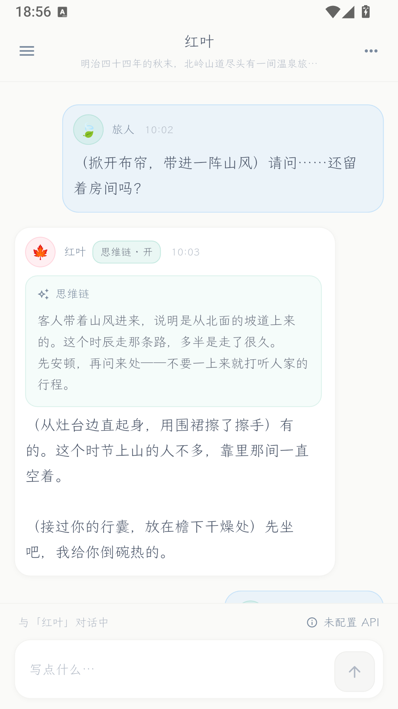
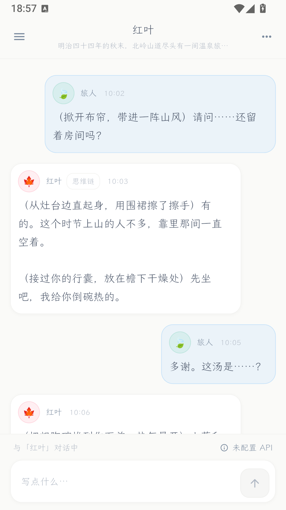
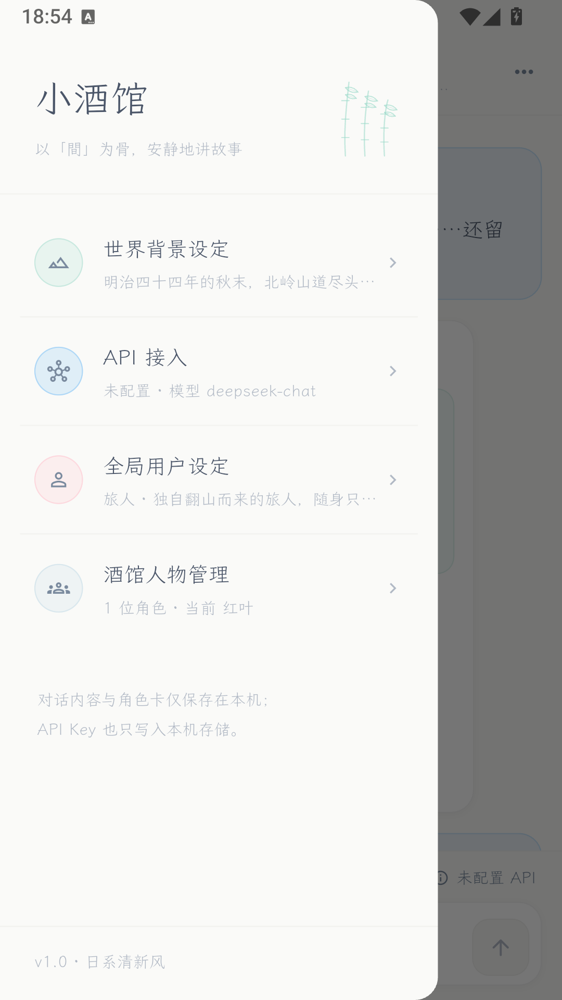
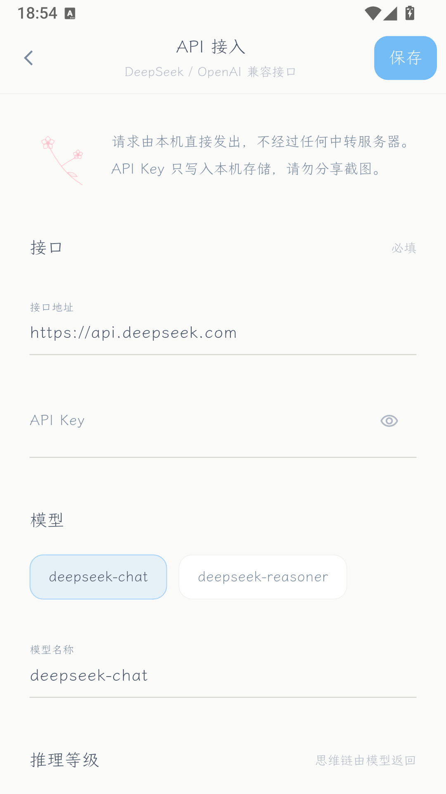
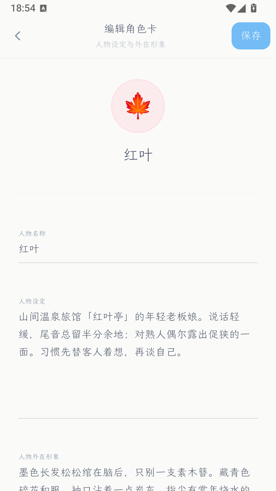
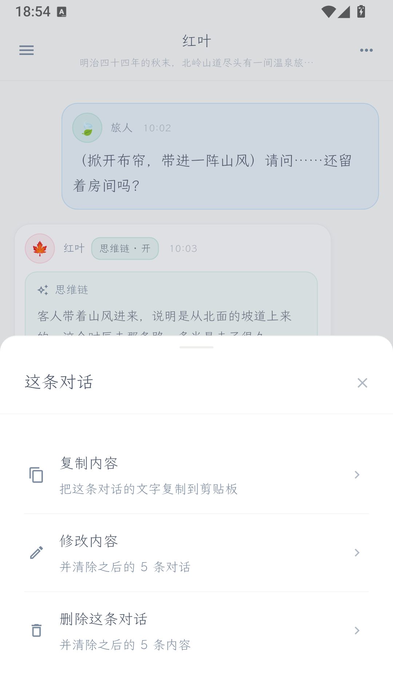
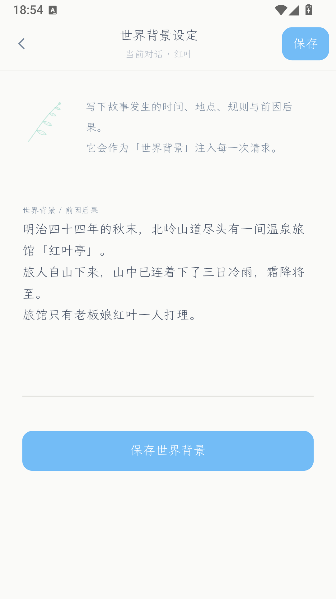
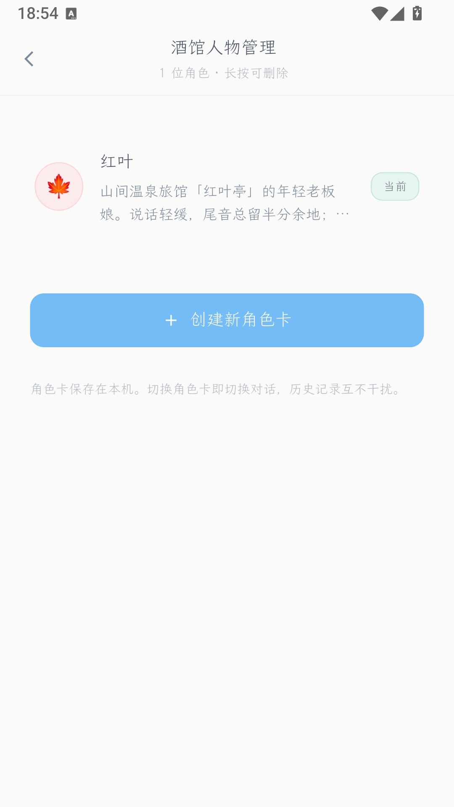

# 小酒馆 · littleTavern

一个面向手机端的「类酒馆」角色扮演对话应用。Flutter / Android 原生实现，直连 DeepSeek（及任意 OpenAI 兼容接口），
界面遵循**日系清新风**（Ma 留白 · 侘寂 · 发丝级边框 · 植物线描）。

> 一个角色卡 = 一段独立对话。先写下角色，故事才能开始。

---

## 界面

| 对话 | 思维链展开 | 思维链收起 |
|---|---|---|
|  |  |  |

| 左上角「栏」 | API 接入 | 角色卡编辑 |
|---|---|---|
|  |  |  |

| 长按操作栏 | 世界背景设定 | 人物管理 |
|---|---|---|
|  |  |  |

---

## 功能

### 对话
- **紧凑气泡流**：头像固定在气泡内部左上角，同角色相邻气泡自动收紧间距
- **点击气泡改内容** —— 保存后清除该条之后的全部消息，从这一条重新开始对话
- **长按气泡**弹出适中的操作栏：复制内容 / 修改内容 / 显示·隐藏思维链 / 删除这条及其后
- **流式输出**：逐字显示，可随时「停止」；中断时若尚无内容则自动撤回气泡
- **思维链**：解析 `reasoning_content`，每条消息可独立展开收起；**不回传给模型**（符合 DeepSeek 要求）

### 角色卡（对话的前提）
- 三要素：**人物名称 / 人物设定 / 人物外在形象**，缺名称不许保存
- 形象用 emoji + 柔和色调（无需相册权限），支持自定义任意符号
- 没有角色卡时输入框禁用，主区只留「创建角色卡」一条路径

### 左上角「栏」
- **世界背景设定**：当前对话的前因后果，注入每次请求
- **API 接入**：接口地址 / Key / 模型（deepseek-chat、deepseek-reasoner、自定义）/ 推理等级四档
  / 温度 / 最大输出 / 流式开关 / 附加 JSON 参数 / **测试连接**
- **全局用户设定**：你在故事中的名称与设定，跨角色卡复用
- **酒馆人物管理**：角色卡增删改，当前角色带标记

### 数据
- 角色卡、会话、用户设定、API 配置全部保存在本机（`shared_preferences`）
- **API Key 只写入本机**，请求由设备直发，不经过任何中转服务器

---

## 技术要点

- **零第三方网络依赖**：流式客户端只用 `dart:io` 的 `HttpClient`，原生直连，不存在浏览器 CORS 问题
- **地址容错**：`https://api.deepseek.com`、带尾斜杠、带 `/v1` 均自动拼接为 `…/chat/completions`
- **错误可读**：HTTP 状态码、接口 `error` 对象、网络异常都渲染为气泡内的提示块，不弹系统对话框
- **推理等级**：`reasoning_effort` 默认不发送（部分兼容接口会返回 400），需要时在设置里显式打开
- **字体**：全局单字重中文楷体（霞鹜文楷 Light），从根上避免粗体，契合「只用 light」的风格约束

### 项目结构

```
app/lib/
├── main.dart                     入口：字体、状态栏、主题装配
├── models.dart                   角色卡 / 消息 / 会话 / 用户 / API 配置
├── store.dart                    全局状态 + 流式对话编排 + 提示词组装
├── api/deepseek.dart             OpenAI 兼容流式客户端（dart:io）
├── theme/
│   ├── jf.dart                   日系清新风 token（颜色/字重/边框/动效）
│   └── botanical.dart            植物线描 CustomPainter（四款）
├── widgets/
│   ├── message_bubble.dart       对话气泡
│   ├── composer.dart             下侧输入方框
│   ├── app_drawer.dart           左上角「栏」
│   ├── page.dart                 二级页骨架 + 表单控件
│   └── common.dart               头像/按钮/输入框/弹栏/确认框
└── screens/
    ├── chat_screen.dart          对话主界面
    ├── character_edit_screen.dart / character_list_screen.dart
    └── api_screen.dart / user_screen.dart / world_screen.dart
```

---

## 快速开始

### 环境
- Flutter 3.35+（本项目在 3.47.4 stable 上构建）
- Android SDK 36 + build-tools 36
- JDK 17（Temurin）

### 构建

```bash
cd app
flutter pub get
flutter build apk --release        # 产物：build/app/outputs/flutter-apk/app-release.apk
```

或使用仓库内脚本（Windows）：

```powershell
pwsh tools/build-apk.ps1            # debug 包
pwsh tools/build-apk.ps1 -Release   # release 包
pwsh tools/run-on-emulator.ps1      # 启动雷电模拟器 + 安装 + 启动 + 截图
```

### 配置 API

首次打开 → 左上角「栏」→ **API 接入**：

| 项目 | 建议值 |
|---|---|
| 接口地址 | `https://api.deepseek.com` |
| API Key | 你的 DeepSeek Key |
| 模型 | `deepseek-chat`（不思考）或 `deepseek-reasoner`（返回思维链） |
| 推理等级 | 关闭即可；需要思考能力时选 `deepseek-reasoner` |
| 发送 `reasoning_effort` | 默认关闭，仅部分兼容接口支持 |

填好后点「测试连接」验证。

---

## 设计系统

「日系清新风」的硬约束，全部落在 `app/lib/theme/jf.dart`：

| 规则 | 落地 |
|---|---|
| 只用 light / extralight 字重 | 全局单字重字体，代码中最高 `FontWeight.w300` |
| 发丝级边框 | 一律 0.8px；卡片 `#d4d4cf` @30%，按钮 @40%，分隔线 @20% |
| 无可见阴影 | 仅 `0 1px 3px rgba(0,0,0,0.03)` 级浮起 |
| 圆角 | 一律 16 / 12，无直角 |
| 不用深色背景 | 米白 `#fafaf8` + 纸白 `#ffffff` |
| 每区块一株植物线描 | `Botanical` CustomPainter，四款轮换 |
| 底线式输入框 + 浮动标签 | `JF.underline()` 全站统一 |
| 慢动效 | 过渡统一 500ms easeInOut；悬停仅上浮 0.5px，按下改透明度不缩放 |
| 尊重 reduced-motion | `MediaQuery.disableAnimations` 时关闭呼吸动画 |

---

## 国内网络提示

构建过程中如果遇到以下问题，原因和对策：

| 现象 | 原因 | 对策 |
|---|---|---|
| 字体 / JDK 下载卡住 | GitHub 直连不稳定 | 走代理或国内镜像（字体用 `ghfast.top`，JDK 用清华 Adoptium） |
| `maven.google.com` 超时 | 该域名不可达 | `android/settings.gradle.kts` 与 `android/build.gradle.kts` 已优先挂阿里云 maven 镜像 |
| Gradle 发行包太慢 | `services.gradle.org` | `gradle-wrapper.properties` 已换腾讯云镜像 |

---

## 已知限制（第一版）

- 严格只做**两人对话**（用户 + 单个 AI 角色），没有群聊
- 头像为 emoji + 色调，不支持真实图片
- 没有角色卡导入 / 导出，没有世界书关键词触发
- 会话是线性的，没有分支树与重新生成

## 后续可以做的

1. 多角色群聊
2. 角色卡导入 / 导出（PNG 卡片、JSON）
3. 头像支持本地图片
4. 会话分支树 / 重新生成 / 左右滑动换回复
5. 世界书（关键词触发注入）
6. 对话导出为长图 / Markdown

---

## 声明

仅供个人学习与创作使用。请遵守你所使用的大模型服务商的条款，勿用于生成违法违规内容。
